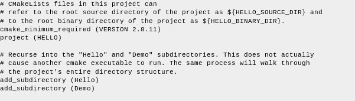
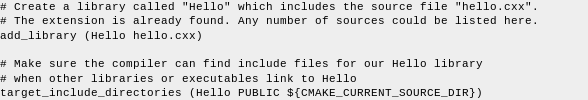
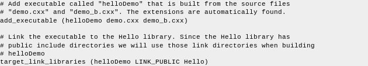
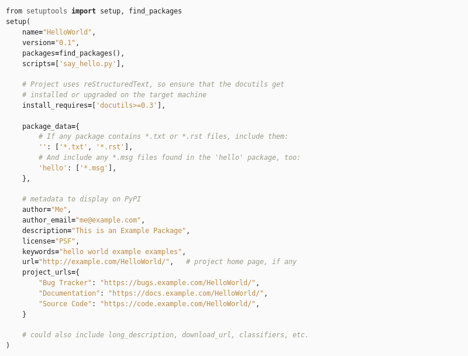
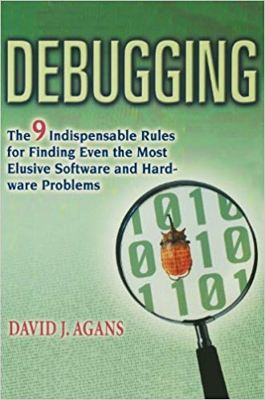
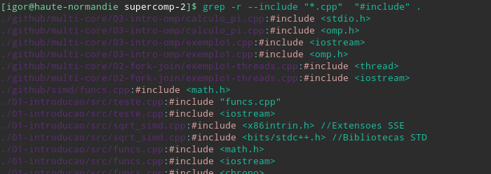

<!-- $theme: default -->

Desenvolvimento Aberto
===

# 

##### Debugging

###### Igor dos Santos Montagner ( [igorsm1@insper.edu.br](mailto:igorsm1@insper.edu.br) )

---

# Aulas passadas

* Modelos de contribuição de código
	- Pull Requests, Patches via e-mail, Bug tracker
* Informações importantes de um projeto
* Escolha de um projeto/issue

---

# Hoje

* Compilando seu projeto
* "Regras" de debugging do livro
* Dicas de como se encontrar no projeto

---

# Gerenciamento de projetos de código

---

# Ferramentas

* C/C++ - CMake
* Python - setuptools (pip, conda)
* Java - Graddle, Maven, Ant, ...
* Javascript - npm, bower, ...

Quais problemas básicos são resolvidos?

----

# Gerenciamento de projetos

Duas principais funcionalidades:

1. Definição de quais objetos serão gerados a partir de quais arquivos
	- Ao atualizar um arquivo só reconstrói os objetos que dependem dele
2. Listar as dependências externas do projeto (bibliotecas e binários)
	- Possível instalar dependências com um comando (pip/npm like)

---

# Gerenciamento de projetos pragmático

Só precisamos mesmo de duas coisas:

1. Compilar o projeto
2. Conseguir rodar a versão mais recente (*master*) lado a lado com a versão de produção

#

**Importante**: 

1. Consulte a documentação de desenvolvimento! 
2. Não precisamos ser especialistas para contribuir!

---

# Exemplo 1: CMakeLists.txt

---

# Exemplo 1: CMakeLists.txt

---

# Exemplo 1: CMakeLists.txt

---

# Exemplo 2: setuptools

---

# Debugging

---

# 9 regras de debug

1. UNDERSTAND THE SYSTEM
1. MAKE IT FAIL
1. QUIT THINKING AND LOOK
1. DIVIDE AND CONQUER
1. CHANGE ONE THING AT A TIME
1. KEEP AN AUDIT TRAIL
1. CHECK THE P LUG
1. GET A FRESH VIEW
1. IF YOU DIDN'T FIX IT, IT AIN'T FIXED

---

# Destrinchando as 4 regras

1. UNDERSTAND THE SYSTEM: 
	- Compile o projeto
	- Rode sua versão 
	- Saiba dizer onde estão os fontes e por qual critério estão organizados
1. MAKE IT FAIL
	- Reproduza o bug

---
# Destrinchando as 4 regras

3. QUIT THINKING AND LOOK
	- Encontre no código onde o bug pode estar
	- Comece geral (em qual arquivo está a funcionalidade?) e vá restringindo (em qual função o bug "explode"?)
1. DIVIDE and CONQUER
	- Faça uma lista de tarefas contendo modificações que você acha que resolveriam o problema e que você precisa aprender para fazê-las
	- Ordene-as de acordo com sua facilidade. 

---

# Como se encontrar no projeto

**Problema**: Como encontro em qual arquivo mexer?

#

**Ferramenta**: comando `grep` permite buscar por strings em todos os arquivos de uma pasta. 

#

**Solução**: 

> `$ grep [OPTIONS] PATTERN FILES

* `PATTERN`: expressão regular
* `FILES`: lista de diretórios ou arquivos

---
# Como se encontrar no projeto

**Exemplo 1**: buscar todos arquivos nas pasta atual (.) e subpastas com o texto "dialog" ignorando maiúsculas/minúsculas.

> `$ grep -r -i dialog .`

#

# 

**Mais info**:
* `man grep` ([disponível online](https://linux.die.net/man/1/egrep))
* Seção *Regular Expressions* é particularmente relevante

---
# Como se encontrar no projeto

**Exemplo 2**: Listas todos os arquivos *.cpp* que fazem algum include

> `$ grep -r --include "*cpp" "#include" .

---
# Próximos passos

1. Escolha em definitivo sua issue
2. Envie uma mensagem no Github/Issue tracker mostrando interesse
3. Registre o projeto escolhido com a Skill "Eu escolho você". No campo *proof*, envie a url da skill desejada.

---

Desenvolvimento Aberto
===

# 

##### Debugging

###### Igor dos Santos Montagner ( [igorsm1@insper.edu.br](mailto:igorsm1@insper.edu.br) )

