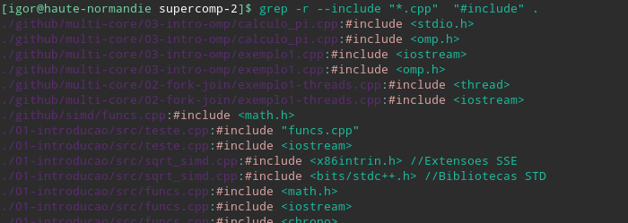

<!-- $theme: default -->

Desenvolvimento Aberto
===

##### Debugging II

###### Igor dos Santos Montagner ( [igorsm1@insper.edu.br](mailto:igorsm1@insper.edu.br) )

---

# Aulas passadas

* Compilando seu projeto
* "Regras" de debugging do livro
* Dicas de como se encontrar no projeto

---

# Hoje

* "Regras" de debugging do livro

# 9 regras de debug

1. UNDERSTAND THE SYSTEM
1. MAKE IT FAIL
1. QUIT THINKING AND LOOK
1. DIVIDE AND CONQUER
1. CHANGE ONE THING AT A TIME
1. KEEP AN AUDIT TRAIL
1. CHECK THE P LUG
1. GET A FRESH VIEW
1. IF YOU DIDN'T FIX IT, IT AIN'T FIXED

---

# Destrinchando as 9 regras

1. UNDERSTAND THE SYSTEM: 
	- Compile o projeto
	- Rode sua versão 
	- Saiba dizer onde estão os fontes e por qual critério estão organizados
1. MAKE IT FAIL
	- Reproduza o bug

---
# Destrinchando as 9 regras

3. QUIT THINKING AND LOOK
	- Encontre no código onde o bug pode estar
	- Comece geral (em qual arquivo está a funcionalidade?) e vá restringindo (em qual função o bug "explode"?)
1. DIVIDE and CONQUER
	- Faça uma lista de tarefas contendo modificações que você acha que resolveriam o problema e que você precisa aprender para fazê-las
	- Ordene-as de acordo com sua facilidade. 

---
# Destrinchando as 9 regras

5. CHANGE ONE THING AT A TIME
7. KEEP AN AUDIT TRAIL
	- Log de como você encontrou onde mexer
	- Log de todos arquivos de interesse e seus usos
	- Log de todas as pesquisas feitas
	- Log de todas as modificações feitas

---
# Destrinchando as 9 regras

7. CHECK THE PLUG
8. GET A FRESH VIEW
	- Professor
	- Colegas trabalhando no mesmo projeto
	- IRC, Mailing list, Issues e PR

---
# Destrinchando as 9 regras

9. IF YOU DIDN'T FIX IT, IT AIN'T FIXED

---
# Como se encontrar no projeto

**Problema**: Como encontro em qual arquivo mexer?

#

**Ferramenta**: comando `grep` permite buscar por strings em todos os arquivos de uma pasta. 

#

**Solução**: 

> `$ grep [OPTIONS] PATTERN FILES

* `PATTERN`: expressão regular
* `FILES`: lista de diretórios ou arquivos

---
# Como se encontrar no projeto

**Exemplo 1**: buscar todos arquivos nas pasta atual (.) e subpastas com o texto "dialog" ignorando maiúsculas/minúsculas.

> `$ grep -r -i dialog .`

#

# 

**Mais info**:
* `man grep` ([disponível online](https://linux.die.net/man/1/egrep))
* Seção *Regular Expressions* é particularmente relevante

---
# Como se encontrar no projeto

**Exemplo 2**: Listas todos os arquivos *.cpp* que fazem algum include

> `$ grep -r --include "*cpp" "#include" .

---
# Como se encontrar no projeto 

Comando `find` ([man page](http://man7.org/linux/man-pages/man1/find.1.html))

**Exemplo**: procurar por arquivos cujo nome é aceito por uma certa expressão regular começando no diretório atual.

> `$ find -iname "regexp" .

---
# Esta semana

* Duas aulas para finalizar seu primeiro PR

#

* Usem as 9 regras! 

# 

* O quê acontece depois do PR? [[1]](https://github.com/spyder-ide/spyder/pull/7698)

---

Desenvolvimento Aberto
===

##### Debugging II

###### Igor dos Santos Montagner ( [igorsm1@insper.edu.br](mailto:igorsm1@insper.edu.br) )
