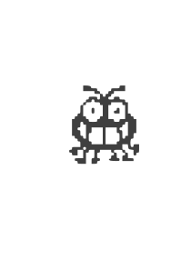

<!-- $theme: default -->

Desenvolvimento Aberto
===

##### Debugging - Parte final

###### Igor dos Santos Montagner ( [igorsm1@insper.edu.br](mailto:igorsm1@insper.edu.br) )

---
# Objetivos desta atividade

1. Baixar um repositório novo e compilar/rodar a versão do master.
2. Reproduzir um bug.
3. Encontrar o arquivo/linha de código que o bug acontece. 
4. Consertar o bug (poucas linhas)

---

### Foco da atividade
	
Enviar um primeiro PR para **começar** a discussão de ter seu PR aceito.

### Tempo destinado a atividade:
	- 4 aulas (~ 6 horas) de estúdio
	- 3 horas de atendimento
	- 4~8 horas extra-classe

# Se você não acabar até o fim da aula de hoje estará oficialmente atrasado

---
# Eu escolho você

Se você não enviou ainda, é o momento de enviar a skill "Eu escolho você" via PR para o repositório da disciplina. 

Coloque no campo *"proof"* a url da Issue que você escolheu. Não esqueça de demonstrar interesse pela issue deixando um comentário. 

---
# Primeiro bug

Se você já enviou seu PR, está no hora de criar um PR para o repositório com a skill "Primeiro Bug". 

No campo *"proof"* você deve colocar um link para o seu PR.

---
# Se você está atrasado

Todas as habilidades podem ser exercitadas se vocês escolherem um [bug da disciplina](https://github.com/igordsm/dev-aberto/issues?q=is%3Aissue+is%3Aopen+label%3A%22help+wanted%22).

#

# Se você já acabou

1. Ajude um colega que está trabalhando no mesmo projeto;
2. Melhore seu PR;
3. Me procure ;)

---
Desenvolvimento Aberto
===

##### Debugging - Parte final

###### Igor dos Santos Montagner ( [igorsm1@insper.edu.br](mailto:igorsm1@insper.edu.br) )
