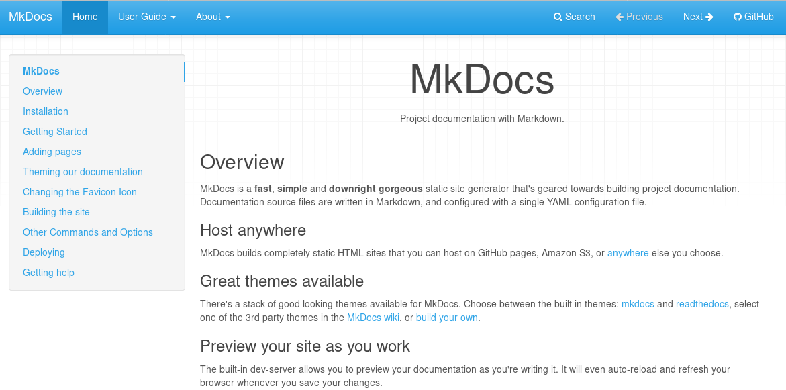
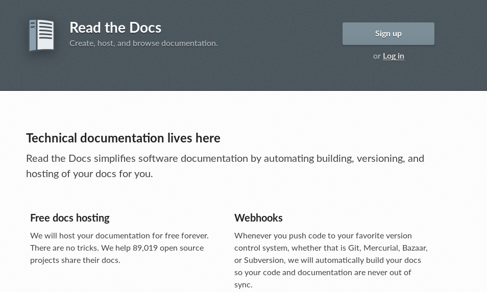

<!-- $theme: default -->

Desenvolvimento Aberto
===

##### Documentação - parte 1

###### Igor dos Santos Montagner ( [igorsm1@insper.edu.br](mailto:igorsm1@insper.edu.br) )

---
# Avisos

Hoje acaba oficialmente o prazo para as duas skills abaixo. 

 

Se você já terminou envie o PR para o repositório da disciplina.

Se não terminou é hora de se preocupar. 

---
# Documentação de software

**Documentação de usuário**:

#

#

#

**Documentação de desenvolvimento**:

#

#

#

---
# Documentação de software

**Documentação de usuário**:

- Instalação
- Funcionalidades
- Onde obter ajuda

---
# Documentação de software

**Documentação de desenvolvimento**:

- Como compilar (dependências, ferramentas usadas, etc)
- Como testar (dependências, ferramentas usadas, etc)
- Estilo de código e outras orientações relacionadas
- Organização do código e arquitetura da aplicação

---
# Documentação de software

Às vezes as coisas se confundem! O que vocês colocariam na documentação de usuário do *Flask*?

E na de desenvolvedor?

---
# Exemplo: Spyder

[https://pythonhosted.org/spyder/

---
# Exemplo: Spyder

---
# Sistemas de documentação

[Sphinx](http://www.sphinx-doc.org/en/master/)

---
# Sistemas de documentação

[Mkdocs](www.mkdocs.org)

---
# Sistemas de documentação

[https://readthedocs.org/](https://readthedocs.org/)

---
# Atividade de Hoje

Vocês receberão um *zip* com o código de um software e zero instruções. Vocês deverão:

1. Aprender como rodar o software
2. Documentar os passos que vocês seguiram para fazê-lo
3. Fazer uma análise crítica do projeto com relação a
	- Arquitetura
	- Qualidade do código
	- Segurança da solução
4. Criar uma documentação de usuário e uma de desenvolvimento baseado em suas anotações

---
# Objetivos desta atividade

1. Entender na prática a necessidade de documentação;
2. Praticar suas habilidades de leitura de código e entendimento da arquitetura de uma aplicação desconhecida;
3. Obter primeira experiência com documentação de desenvolvimento e de usuário.

---
# Não são objetivos desta atividade

1. Mostrar nenhum tipo de boa prática de programação
2. Melhorar o software analisado
3. Criticar o desenvolvedor que trabalhou antes no projeto

---
# Agora

Vamos fazer o roteiro **pelo menos até a pergunta 5**: 

1. Aprender como rodar o software
2. Documentar os passos que vocês seguiram para fazê-lo

**Duração**: 30~45 minutos

---
# Agora

3. Fazer uma análise crítica do projeto com relação a
	- Arquitetura
	- Qualidade do código
	- Segurança da solução

**Duração**: 15 minutos para reolhar o código, 15 minutos para discussões.

---
# Para casa

4. Criar uma documentação de usuário e uma de desenvolvimento baseado em suas anotações

Skill *Caminho encontrado*: entender como um software sem documentação funciona e criar um guia de uso.

Mais detalhes da entrega no roteiro físico.

---
# Próxima aula

- Apresentação das documentações criadas
- Tradução de software: Internacionalização e localização

---
Desenvolvimento Aberto
===

##### Documentação

###### Igor dos Santos Montagner ( [igorsm1@insper.edu.br](mailto:igorsm1@insper.edu.br) )
