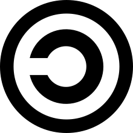
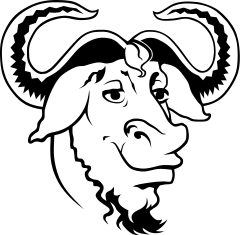

<!-- $theme: default -->

Desenvolvimento Aberto
===

##### Distribuição de software

###### Igor dos Santos Montagner ( [igorsm1@insper.edu.br](mailto:igorsm1@insper.edu.br) )

---
Até agora
=========

* Ferramentas de colaboração
* Modificações de código
* Documentação e tradução de código

---
# Licenças de software

* Governam a **distribuição** de um software
* Cessão de direitos do autor para outras pessoas
* Listam quais permissões um usuário (não) tem

---
# Distribuição de software

Escrever software é considerado um *trabalho intelectual*, estando então sujeito às leis de direitos autorais.

* Essas leis são específicas de cada país
* Autoria *vs* exploração econômica
* Engloba tanto código fonte como binários

---
# Direito autoral brasileiro

Não é necessário registro. Não vale para ideias. 

* **Direito moral**: 
	- assegura a autoria da obra ao autor original
	- integridade da obra
	- instransferível e irrevogável
* **Direito patrimonial**: 
	- exploração econômica da obra. 
	- licenciado ou cedido
	- **copyright** em inglês

---
# Por que isto é importante?

O dono dos direitos autorais (patrimoniais) pode controlar:

1. Distribuição, parcial ou total;
2. Criação de obras derivadas
3. Reprodução (execução)

---
# Contributor License Agreement

* Documento usado por projetos para incorporar contribuições externas
* Dá ao projeto uma licença não exclusiva (normalmente) e irrevogável para o projeto explorar sua contribuição.
* Mantém sua autoria.

---
# End User License Agreement

Termo usado para aquelas condições que ~~não lemos~~ aceitamos ao instalar software proprietário ou nos registramos em um site/serviço.

# 

Ignorado por aproximadamente 90% dos usuários ([fonte](https://measuringu.com/eula/))

---
# End User License Agreement

E por algumas empresas... [Fonte](https://www.makeuseof.com/tag/10-ridiculous-eula-clauses-agreed/)

---
# End User License Agreement

E por algumas empresas... [Fonte](https://www.makeuseof.com/tag/10-ridiculous-eula-clauses-agreed/)

---
# End User License Agreement

Restrições típicas encontradas em EULAs:

* Software é licenciado, não vendido;
* É proibido engenharia reversa
* Não pode modificar ou explorar limitações / vulnerabilidades
* Isenta responsabilidades pelo (mau) uso do software

---
# EULA (serviços)

Informações típicas encontradas em EULAs de serviços:

* Restrições de idade;
* Uso dos dados coletados:
* Término unilateral do serviço
* Garantias de disponibilidade e responsabilidade

---
# EULA (AWS)

[fonte](https://aws.amazon.com/service-terms/): https://aws.amazon.com/service-terms/

---
# End User License Agreement

[fonte](https://xkcd.com/501/)

---
# Um pouco de história

Richard Stallman fez um interpretador Lisp (MIT ~ 1985)

---
# Um pouco de história

* Uma empresa chamada *Symbolics* licenciou o LISP do MIT para rodar em máquinas como a acima

---
# Um pouco de história

* Uma empresa chamada *Symbolics* licenciou o LISP do MIT para rodar em máquinas como a acima
* Fez modificações no software
* Deu um jeito de não devolvê-las para o MIT....
* E eliminou a competição...

---
# Um pouco de história

* Stallman ficou #$@#$@#$@
* e criou a primeira licença de software *livre*: *Emacs General Public License*

### Principal característica:

1. Toda cópia do programa deverá estar acompanhada do código fonte;
1. Se uma modificação do software for distribuída, ela deverá estar sujeita aos mesmos termos do software original;

--- 
# Um pouco de história - 1985

[GNU Manifesto](https://www.gnu.org/gnu/manifesto.html): descrevia um esforço em criar um sistema completamente livre cujo destino estivesse nas mãos dos usuários

--- 
# Um pouco de história - 1990

Linus Torvalds tinha um kernel **experimental** pronto.

---
# Um pouco de história

#

**Leitura complementar:** Free Software, Free Society: Selected Essays of Richard M. Stallman. 

---
# Um pouco de história

#

**Leitura complementar:** Just for Fun: The Story of an Accidental Revolutionary, Linus Torvalds and David Diamond

---
# Licenças de software (livre)

Garantem 4 liberdades para um usuário ao usar um software:

0. Execução sem restrições
2. Estudo e modificação do software; 
3. Redistribuir cópias;
4. Redistribuir cópias das suas modificações.

Exemplos: GPL, LGPL

**Distribuir os fontes é pré-requisito dos itens 1 e 3!**

Chamadas também de *recíprocas*.

---
# Licenças de software de código aberto

* Muitas vezes chamadas de *permissivas*;
* Normalmente não garatem a liberdade 4;
* Podem fazer outras pequenas exigências ou restrições

Exemplos: MIT, BSD

* Permitem a distribuição de software com partes proprietárias
* Permitem a venda e completo *rebranding* do software sem nenhuma contribuição para o autor original.

---
# Atividade 

Vamos nos posicionar em relação a um tema muito polêmico nos últimos meses:

## Commons Clause

* Pesquisem o quê é
* Algumas vantagens e desvantagens
* e escrevam um pequeno texto se posicionando contra ou a favor

---
Desenvolvimento Aberto
===

##### Distribuição de software

###### Igor dos Santos Montagner ( [igorsm1@insper.edu.br](mailto:igorsm1@insper.edu.br) )

