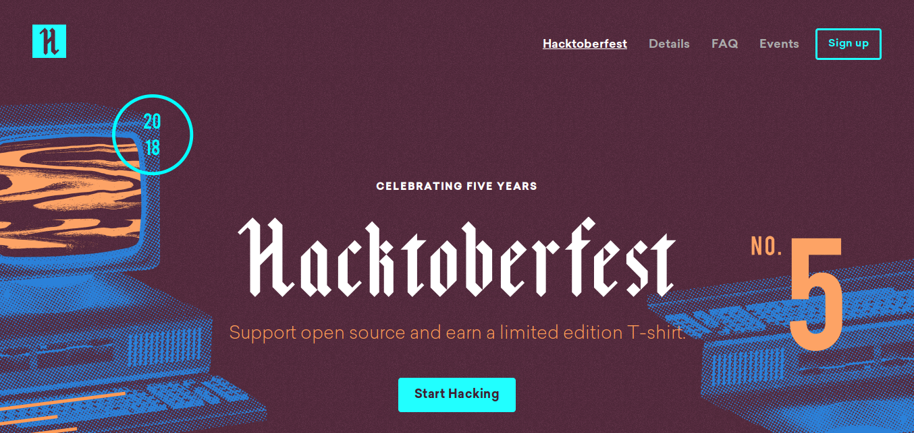

<!-- $theme: default -->

Desenvolvimento Aberto
===

##### Avisos

###### Igor dos Santos Montagner ( [igorsm1@insper.edu.br](mailto:igorsm1@insper.edu.br) )

---
Até agora
=========

* Ferramentas de colaboração
* Modificações de código
* Documentação e tradução de código
* Licenças e distribuição de software
* Sprint do projeto
	- Requisitos para o conceito C

---
# Atividades em sala de aula

1. Distribuição de software (**Outubro**)
	- Pacotes Python (pip e setup.py)
	- Pacotes Debian/Ubuntu
2. Integração contínua (**Novembro**)
3. Propostas são aceitas :)

---
# Novas skills

**Professor por um dia**: Criou uma atividade de sala de aula para o curso e a aplicou - **10XP**

---
# Novas skills

**Toca Raul**: PR aceito no projeto de desafios de DesSoft. Limitado a uma issue por aluno - **5XP**

---
# Novas skills

**Evento de verdade!**: Participou pessoalmente de um evento da área - **5XP**

---
# Novas skills

**HacktoberFest**: Conseguiu enviar 5 PRs no mês de outubro - **40XP**

---
# Hacktoberfest

[https://hacktoberfest.digitalocean.com/](https://hacktoberfest.digitalocean.com/)

---
# Próximas aulas

1. Sprint do projeto - 4 aulas
2. Atividade de Distribuição de Software
3. Sprint do projeto - 3 aulas
4. Atividade de aula II
5. Sprint do projeto - 3 aulas
6. Atividade de aula III
7. Sprint do projeto - 3 aulas

---
Desenvolvimento Aberto
===

##### Avisos

###### Igor dos Santos Montagner ( [igorsm1@insper.edu.br](mailto:igorsm1@insper.edu.br) )
